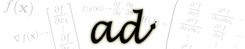

# `ad`



**Fast, transparent first- and second-order automatic differentiation for Python.**

The `ad` package is a free, cross-platform Python library that transparently handles calculations of first- and second-order derivatives of nearly any mathematical expression, regardless of the base numeric type (`int`, `float`, `complex`, etc.).

Calculations can be performed in an interactive session (as with a calculator) or inside regular Python programs. Existing calculation code can usually run with little or no change.

Use `ad` when a model is easier to express as code than by manually deriving and maintaining symbolic derivatives:

- optimization with exact first and second derivatives
- numerical workflows combining real and complex arithmetic
- sensitivity checks for scientific and engineering models
- matrix and least-squares workflows where AD compatibility matters
- quick experiments that should still produce gradients and Hessians

## Why `ad`?

`ad` is designed so ordinary Python math keeps working while derivatives are tracked in parallel.

```python
from ad import adnumber
from ad.admath import sin

x = adnumber(1)
y = sin(2 * x)

print(y)  # ad(0.9092974268256817)
print(y.d(x))  # -0.8322936730942848
print(y.d2(x))  # -3.637189707302727
```

## Main Features

1. Transparent derivative tracking through ordinary arithmetic and expressions.
2. First derivatives, second derivatives, cross-derivatives, gradients, Hessians, and Jacobians.
3. Broad math coverage via `ad.admath` (real and complex compatible where appropriate).
4. AD-compatible linear algebra routines via `ad.linalg` (`chol`, `lu`, `qr`, `solve`, `lstsq`, `inv`).
5. Optimization helper `gh(...)` for generating gradient and Hessian callables.
6. Lightweight implementation in pure Python (NumPy optional, but commonly used).

## Documentation

- [Theory](theory.md) explains automatic differentiation ideas and linear algebra background.
- [Installation](installation.md) shows modern install flows (pip, uv, poetry, pdm, hatch, source).
- [Quickstart](quickstart.md) walks through setup, core usage, arrays, and derivative access.
- [API Reference](api.md) lists public classes, helpers, and module-level functionality.
- [References](references.md) contains acknowledgments, licensing, links, and citation notes.
