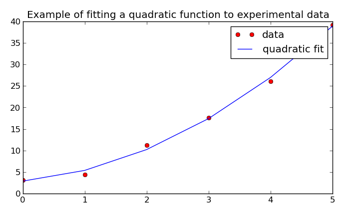

# Theory

## Automatic Differentiation

Automatic differentiation (AD) exploits the fact that every computer program, no matter how complicated, executes a sequence of elementary arithmetic operations (addition, subtraction, multiplication, division, etc.) and elementary functions (`exp`, `log`, `sin`, `cos`, etc.). By applying the chain rule repeatedly to these operations, derivatives can be computed automatically and accurately to working precision.

In `ad`, this is done transparently while keeping ordinary numeric behavior. Values are wrapped so that both the nominal value and derivative information flow through the same computation graph.

### First-order derivatives

For a scalar function $y = f(x)$, `ad` tracks $\,dy/dx\,$ directly during evaluation. This avoids symbolic manipulation and avoids finite-difference truncation and step-size tuning.

Core propagation rules used repeatedly are:

$$
\frac{d}{dx}(u + v) = u' + v'
$$

$$
\frac{d}{dx}(u v) = u'v + uv'
$$

$$
\frac{d}{dx}\left(\frac{u}{v}\right) = \frac{u'v - uv'}{v^2}
$$

$$
\frac{d}{dx}f(g(x)) = f'(g(x))\,g'(x)
$$

### Second-order derivatives

`ad` also supports second derivatives and mixed partial derivatives. For multivariate functions this enables curvature-aware methods and Hessian-based analysis.

For example, for $y=f(x)$:

$$
\frac{d^2y}{dx^2} = \frac{d}{dx}\left(\frac{dy}{dx}\right)
$$

and for a scalar function $f(x_1,\dots,x_n)$, mixed partials are of the form:

$$
\frac{\partial^2 f}{\partial x_i\,\partial x_j}
$$

### Gradient, Hessian, Jacobian

- Gradient: vector of first derivatives with respect to selected variables.
- Hessian: matrix of second derivatives with respect to selected variables.
- Jacobian: stacked gradients for multiple dependent outputs.

For $f: \mathbb{R}^n \to \mathbb{R}$:

$$
\nabla f(x) =
\begin{bmatrix}
\frac{\partial f}{\partial x_1} \\
\vdots \\
\frac{\partial f}{\partial x_n}
\end{bmatrix}
$$

$$
H_f(x) = \left[\frac{\partial^2 f}{\partial x_i\,\partial x_j}\right]_{i,j=1}^n
$$

For $F: \mathbb{R}^n \to \mathbb{R}^m$ with components $F_k$:

$$
J_F(x) = \left[\frac{\partial F_k}{\partial x_j}\right]_{k=1..m,\,j=1..n}
$$

## Numeric Type Transparency

The package is designed so underlying numeric types interact as they normally do. Base numeric types (`int`, `float`, `complex`, etc.) remain meaningful, and resulting behavior follows Python's normal arithmetic semantics.

## Arrays and Matrix Workflows

AD values can be placed in NumPy arrays, matrices, lists, or tuples. Standard array operations continue to work while derivatives are tracked for each participating variable.

For vector-valued computations, this means derivatives can be organized naturally into Jacobians and Hessians without rewriting the original model equations.

## Linear Algebra Theory

The `ad.linalg` submodule was created to overcome the limitations of performing AD with compiled numerical routines (for example LAPACK-backed operations where internal derivative visibility can be lost).

The translated algorithms are AD-compatible and mirror familiar linear algebra operations.

### Cholesky decomposition

Cholesky decomposition takes a symmetric positive-definite matrix `A` and decomposes it into triangular factors:

$$
A = L L^T = U^T U
$$

where `L` is lower triangular and `U` is upper triangular.

### LU decomposition

LU decomposition factors a matrix into lower and upper triangular components, with a permutation matrix for pivoting. It is closely related to Gaussian elimination and is central to solving square systems, matrix inversion, and determinant computation.

### QR decomposition

For an `m x n` matrix `A`, QR decomposition writes:

$$
A = Q R
$$

with orthogonal `Q` and upper-triangular `R`. Because

$$
Q^T Q = I,
$$

solving

$$
Ax=b
$$

can be rewritten as

$$
Rx = Q^T b,
$$

which is often numerically convenient.

### Linear systems and inverse

- General systems are solved through Gaussian elimination.
- Least-squares systems use QR-based methods.
- Matrix inversion is performed by solving against the identity matrix.

The inverse relation is defined by:

$$
A^{-1}A = I.
$$

Floating-point arithmetic may produce tiny off-diagonal residuals when verifying identities (for example `A^{-1}A`), which is expected numerical behavior.

### Least-squares fit example output

The original documentation includes a quadratic least-squares fit example visualized with Matplotlib:

## Additional notes from original docs

- Existing calculation code can run with no or little modification.
- The package can be used in interactive calculator-style sessions or full Python programs.
- Algorithms in `ad.linalg` were influenced by implementations from RosettaCode tasks.
